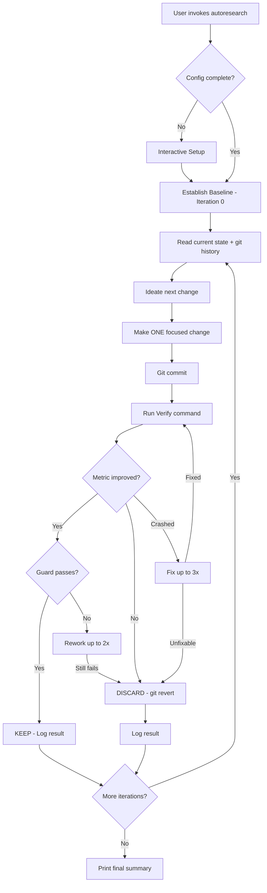
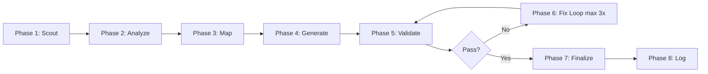

# System Architecture

## Overview

Autoresearch now ships as a dual distribution: the original Claude Code plugin and a Codex plugin with a wrapper CLI. The Claude distribution remains markdown-driven. The Codex distribution adds a small Python wrapper plus a canonical JSON command spec that preserves the same command and flag contract.

## Component Diagram

```mermaid
graph TB
    subgraph "Claude Runtime"
        CC[Claude Code CLI]
        PS[Claude Plugin System]
    end

    subgraph "Codex Runtime"
        CX[Codex CLI]
        CP[Codex Plugin System]
        CW[Wrapper CLI]
    end

    subgraph "Shared Contract"
        SPEC[autoresearch-command-spec.json]
    end

    subgraph "Claude Distribution"
        CMD[Commands Layer]
        SKILL[Claude SKILL.md]
        REF[Claude Reference Protocols]
    end

    subgraph "Codex Distribution"
        CSKILL[Codex SKILL.md]
        CREF[Codex Compact References]
    end

    subgraph "Commands (9 subcommands + main)"
        C1[/autoresearch]
        C2[/autoresearch:plan]
        C3[/autoresearch:debug]
        C4[/autoresearch:fix]
        C5[/autoresearch:security]
        C6[/autoresearch:ship]
        C7[/autoresearch:scenario]
        C8[/autoresearch:predict]
        C9[/autoresearch:learn]
        C10[/autoresearch:reason]
    end

    subgraph "Reference Protocols"
        R1[autonomous-loop-protocol.md]
        R2[core-principles.md]
        R3[results-logging.md]
        R4[plan-workflow.md]
        R5[debug-workflow.md]
        R6[fix-workflow.md]
        R7[security-workflow.md]
        R8[ship-workflow.md]
        R9[scenario-workflow.md]
        R10[predict-workflow.md]
        R11[learn-workflow.md]
        R12[reason-workflow.md]
    end

    CC --> PS
    PS --> CMD
    CMD --> SKILL
    SKILL --> REF
    CX --> CP
    CX --> CW
    CP --> CSKILL
    CW --> CSKILL
    SPEC --> CMD
    SPEC --> CSKILL
    CMD --> C1 & C2 & C3 & C4 & C5 & C6 & C7 & C8 & C9 & C10
    C1 --> R1
    C2 --> R4
    C3 --> R5
    C4 --> R6
    C5 --> R7
    C6 --> R8
    C7 --> R9
    C8 --> R10
    C9 --> R11
    C10 --> R12
```

## Data Flow — Core Autoresearch Loop



## Learn Subcommand Flow

Supports 4 modes: `init` (from scratch), `update` (diff-based targeting), `check` (read-only health), `summarize` (quick inventory). Update mode uses git-diff scoping to identify changed files and maps them to affected docs for targeted regeneration.



## Directory Structure

```
claude-plugin/
├── .claude-plugin/
│   └── plugin.json              # Plugin metadata (name, version, author)
├── commands/
│   ├── autoresearch.md          # Main command registration
│   └── autoresearch/
│       └── {subcommand}.md      # One file per subcommand (9 files: debug, fix, learn, plan, predict, reason, scenario, security, ship)
└── skills/
    └── autoresearch/
        ├── SKILL.md             # Main skill definition v1.8.0 (loaded by Claude Code)
        └── references/
            └── {workflow}.md    # Detailed protocol per command and shared protocol
```

## Key Architectural Decisions

1. **Markdown-only architecture** -- no compiled code, no runtime dependencies. The plugin is pure markdown consumed by Claude Code's skill system.
2. **Shared command spec** -- `plugins/autoresearch/resources/autoresearch-command-spec.json` is the canonical command, flag, output, and stop-condition contract.
3. **Reference file pattern** -- both skills act as routers and load workflow guidance from `references/`.
4. **Git as state management** -- no database or external state. Git commits serve as experiment log, rollback mechanism, and learning memory.
5. **Mechanical verification only** -- all decisions are based on command output (exit codes, parsed numbers), never subjective assessment.
6. **Translated setup gate** -- Claude uses `AskUserQuestion`; Codex uses `request_user_input` or concise direct question batches.
7. **Diff-based targeting (update mode)** -- learn subcommand uses `git diff` to scope changes and maps them to affected docs, avoiding unnecessary full regeneration.

## Integration Points

- **Claude Code Plugin System** -- commands registered via `commands/` directory, skill loaded via `skills/` directory
- **Codex Plugin System** -- skill loaded via `plugins/autoresearch/skills/`, wrapper launched via `plugins/autoresearch/scripts/autoresearch_cli.py`
- **Git** -- used for memory, rollback, staleness detection, changelog generation
- **Shell commands** -- verify/guard commands are user-defined shell commands
- **MCP servers** -- any MCP server configured in Claude Code is available during loops
- **Chain integration** -- subcommands can pipe output to each other via `--chain` flag and `handoff.json`

See also: [Project Overview](project-overview-pdr.md) | [Codebase Summary](codebase-summary.md) | [Code Standards](code-standards.md)
